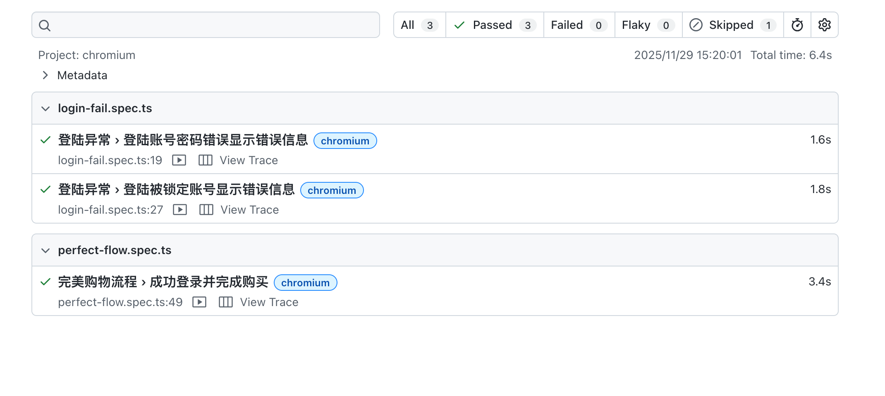

# Sauce Demo 自动化测试项目
一个使用 Playwright 和 TypeScript 构建的 Web 自动化测试框架，对 [Sauce Demo](https://www.saucedemo.com/) 网站进行端到端测试。

## 🚀 技术栈
- **测试框架**: Playwright
- **编程语言**: TypeScript
- **设计模式**: Page Object Model
- **容器化**: Docker
- **报告系统**: Playwright Report Html
- **CI/CD**: GitHub Actions

## 📁 项目结构
```
sauce-demo-playwright/
├── pages/          # 页面对象模型
├── tests/          # 测试用例
├── fixtures/       # 通用插件
├── page-data/      # 测试数据
└── .github/        # CI/CD 工作流
```


## 🛠️ 快速开始

### 方式一：本地运行（开发环境）

#### 前置条件
- Node.js 18+
- npm

#### 安装与运行
```bash
# 克隆仓库
git clone https://github.com/yuguomin/playwright-sauce-demo-project.git
cd playwright-sauce-demo-project

# 安装依赖
npm install

# 运行测试
npx playwright test

# 打开HTML报告
npx playwright show-report
```

### 方式二：Docker 运行

#### 前置条件
- Docker 20.10+
```bash
# 克隆仓库
git clone https://github.com/yuguomin/playwright-sauce-demo-project.git
cd playwright-sauce-demo-project

# 构建镜像
docker build -t playwright-tests .

# 运行测试并生成报告
docker run --rm -v $(pwd)/test-results:/tests/playwright-report playwright-tests

# 查看测试报告
open test-results/index.html
```

## ✅ 测试场景覆盖

- 用户登录（成功/失败场景）
- 商品浏览与排序
- 购物车管理
- 下单流程
- 用户登出

## 📊 测试报告

### Allure 报告


### CI/CD 状态
